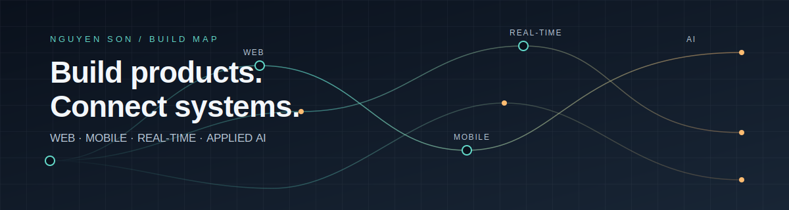

  

<h1 align="center">Nguyen Son</h1>

  Full-stack product builder exploring web, mobile, real-time systems, and applied AI.

## Building at the intersection of product and systems

I enjoy turning complicated workflows into products people can actually use: from cross-platform apps and operations dashboards to real-time experiences and AI-assisted tools.

### Current focus

- End-to-end web and mobile product development
- Real-time workflows, location-aware features, and operational tooling
- Applied AI and computer vision with practical hardware/software integration
- Reliable APIs, containers, and developer-friendly delivery workflows

### Selected work

| Project | What it explores |
| --- | --- |
| [FoodFlow](https://github.com/JasonTM17/FoodDelivery_App) | Real-time food delivery with a NestJS API, Next.js management apps, Flutter clients, Supabase Realtime/PostGIS, and Docker. |
| [Money Management](https://github.com/JasonTM17/Money_Management_App) | An offline-first Flutter finance app with PIN/biometrics, SQLite, Riverpod, and a Fastify/PostgreSQL API. |
| [VN TravelAI](https://github.com/JasonTM17/VN_TravelAI) | A Vietnam travel marketplace and AI trip-planning experience built with Next.js, Fastify, and Docker. |
| [AI-powered waste sorting](https://github.com/JasonTM17/App_AI_powered_waste_sorting) | A waste-sorting system combining YOLO, a PySide6 control app, dashboard tooling, UART/Arduino, and Supabase. |

### Tools I keep reaching for

`TypeScript` · `React` · `Next.js` · `NestJS` · `Flutter` · `Python` · `PostgreSQL` · `Docker`

### Elsewhere

- [GitHub — @JasonTM17](https://github.com/JasonTM17)

  Build thoughtfully. Ship deliberately. Keep learning.

