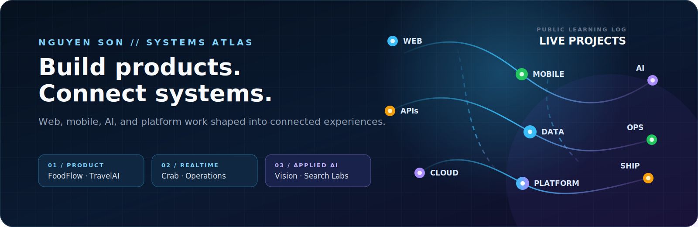

<code>SOFTWARE ENGINEERING · DEVOPS · SYSTEMS</code>

<h1 align="center">Hi, I'm Nguyễn Tiến Sơn 👋</h1>

  <strong>Learning Software Engineering by building. Learning DevOps by shipping thoughtfully.</strong>

  I connect web, mobile, AI, Java, and platform ideas through hands-on projects.

  <em>I'm still learning, and thoughtful feedback, suggestions, and constructive guidance are always welcome.</em>

<!-- AUTO:PROJECT_BADGES:START -->

  
  

<!-- AUTO:PROJECT_BADGES:END -->

  

<!-- AUTO:PROJECT_STATS:START -->

  <strong>25</strong> public projects &nbsp;&middot;&nbsp;
  <strong>4</strong> project focus areas &nbsp;&middot;&nbsp;
  <strong>1</strong> interactive 3D portfolio

<!-- AUTO:PROJECT_STATS:END -->

## What I'm Learning to Build

These focus areas reflect the systems I am actively studying, designing, and building.

- <strong>Connected product experiences</strong> &mdash; web, mobile, admin, and API surfaces that solve one workflow together.
- <strong>Real-time operations</strong> &mdash; delivery, ride-hailing, location-aware, and back-office systems.
- <strong>Applied AI</strong> &mdash; trip planning, computer vision, algorithm visualisation, and hardware/software bridges.
- <strong>Platform-minded delivery</strong> &mdash; containers, CI, observability, cloud infrastructure, and developer portals.

## Project Focus — Learning in Public

### 01 / Product Operations

**[FoodFlow](https://github.com/JasonTM17/FoodDelivery_App) + [Crab](https://github.com/JasonTM17/Crab_Mobile_Flutter)**

Delivery, ride-hailing, wallet, chat, location-aware flows, and the admin surfaces that keep them running.

  
  
  
  

### 02 / Mobile Finance

**[Money Management](https://github.com/JasonTM17/Money_Management_App)**

Offline-first finance with PIN and biometric protection, local SQLite state, and a Fastify/PostgreSQL sync API.

  
  
  
  

### 03 / Applied AI

**[VN TravelAI](https://github.com/JasonTM17/VN_TravelAI) + [Waste Sorting](https://github.com/JasonTM17/App_AI_powered_waste_sorting)**

AI trip planning and computer vision brought into product and physical-control workflows.

  
  
  
  

### 04 / Platform Delivery

**[DevHire Cloud](https://github.com/JasonTM17/DevHire_Cloud_Spring_Microservices) + [Internal Developer Platform](https://github.com/JasonTM17/Internal_Developer_Platform_DevOps) + [CampusCore](https://github.com/JasonTM17/CampusCore_FullStack_Individual)**

Microservices, self-service delivery, GitOps, infrastructure as code, observability, and cloud operations.

  
  
  
  

## Project Portfolio

<!-- AUTO:PROJECT_ARCHIVE:START -->
Explore **25 public projects** across product engineering, mobile development, applied AI, and platform delivery.

### Recently Updated

- **[Aethera ChillTimeWeb](https://github.com/JasonTM17/Aethera_ChillTimeWeb)** · TypeScript · 2026-07-19

  A cinematic editorial studio experience built with React, Vite, Tailwind CSS, and TypeScript.

- **[DevHire Cloud](https://github.com/JasonTM17/DevHire_Cloud_Spring_Microservices)** · Java · 2026-07-19

  Java 21 Spring Boot microservices learning platform for recruitment with Kafka, OpenSearch, Docker, Kubernetes, Terraform, observability, CI/CD, and a RAG assistant.

- **[Horror Game Funny](https://github.com/JasonTM17/Horror_Game_Funny)** · GDScript · 2026-07-19

  ROOM 407: THE LAST SHIFT — a source-only first-person psychological horror game built with Godot 4.7.1 and GDScript.

- **[OpsMind AI](https://github.com/JasonTM17/OpsMind_AI)** · In progress · 2026-07-19

  An early-stage learning project currently taking shape.

- **[Velorah Dream](https://github.com/JasonTM17/Velorah_Dream)** · TypeScript · 2026-07-19

  Cinematic React + TypeScript studio site with responsive editorial sections, accessible navigation, and viewport-managed motion.

  
<strong>Browse All 25 Projects</strong>

| Project | Technology / Status | Updated |
| --- | --- | --- |
| [Aethera ChillTimeWeb](https://github.com/JasonTM17/Aethera_ChillTimeWeb) | TypeScript | 2026-07-19 |
| [DevHire Cloud](https://github.com/JasonTM17/DevHire_Cloud_Spring_Microservices) | Java | 2026-07-19 |
| [Horror Game Funny](https://github.com/JasonTM17/Horror_Game_Funny) | GDScript | 2026-07-19 |
| [OpsMind AI](https://github.com/JasonTM17/OpsMind_AI) | In progress | 2026-07-19 |
| [Velorah Dream](https://github.com/JasonTM17/Velorah_Dream) | TypeScript | 2026-07-19 |
| [AgriCore](https://github.com/JasonTM17/AgriCore_SpringBoot_Microservices) | Java | 2026-07-18 |
| [AgriInsight](https://github.com/JasonTM17/AgriInsight) | In progress | 2026-07-18 |
| [FoodFlow](https://github.com/JasonTM17/FoodDelivery_App) | TypeScript | 2026-07-18 |
| [LinguaFlow](https://github.com/JasonTM17/Language_App) | TypeScript | 2026-07-18 |
| [BookStore](https://github.com/JasonTM17/Ecommerce_BookStore) | TypeScript | 2026-07-16 |
| [VN TravelAI](https://github.com/JasonTM17/VN_TravelAI) | TypeScript | 2026-07-16 |
| [Money Management](https://github.com/JasonTM17/Money_Management_App) | Dart | 2026-07-14 |
| [LeetRank](https://github.com/JasonTM17/Leetrank_Project) | TypeScript | 2026-07-13 |
| [MilkTea Iku](https://github.com/JasonTM17/MilkTea_Iku) | TypeScript | 2026-07-13 |
| [Laptop Shop](https://github.com/JasonTM17/Laptopshop_Spring_Boot_MVC) | Java | 2026-07-02 |
| [15-puzzle AI Lab](https://github.com/JasonTM17/AI_Algothrithm_Study_University) | Python | 2026-07-01 |
| [8-puzzle AI Lab](https://github.com/JasonTM17/AI_Algothrithm_Invidual_Study_University) | Python | 2026-06-30 |
| [AI-powered waste sorting](https://github.com/JasonTM17/App_AI_powered_waste_sorting) | Python | 2026-06-30 |
| [Crab](https://github.com/JasonTM17/Crab_Mobile_Flutter) | Dart | 2026-05-28 |
| [ON/OFF](https://github.com/JasonTM17/ON-OFF_JS) | TypeScript | 2026-05-16 |
| [Internal Developer Platform](https://github.com/JasonTM17/Internal_Developer_Platform_DevOps) | TypeScript | 2026-05-15 |
| [WanderViet](https://github.com/JasonTM17/ChillTravel_NextJS) | TypeScript | 2026-05-15 |
| [Wavestream](https://github.com/JasonTM17/Wavestream_Soundcloud) | TypeScript | 2026-05-06 |
| [JobHunter](https://github.com/JasonTM17/JobHunter_SpringBoot_RestfulAPI_React) | TypeScript | 2026-05-02 |
| [CampusCore](https://github.com/JasonTM17/CampusCore_FullStack_Individual) | TypeScript | 2026-04-25 |

<!-- AUTO:PROJECT_ARCHIVE:END -->

## GitHub Activity

  <a href="https://github.com/JasonTM17?tab=overview">
    <picture>
      <source media="(prefers-color-scheme: dark)" srcset="https://raw.githubusercontent.com/JasonTM17/JasonTM17/output/github-contribution-grid-snake-dark.svg" />
      <source media="(prefers-color-scheme: light)" srcset="https://raw.githubusercontent.com/JasonTM17/JasonTM17/output/github-contribution-grid-snake.svg" />
      
    </picture>
  </a>

  <em>Learning deliberately. Systems-minded. Building the next connection.</em>

